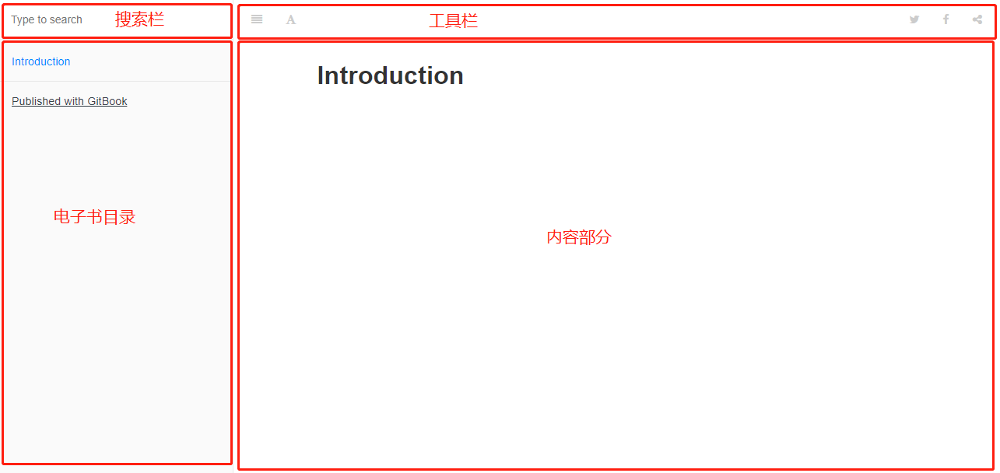

## gitbook安装与使用介绍
#### 1. 什么是gitbook

​	借用百度百科上面的一句话，GitBook 是一个基于 Node.js 的命令行工具，可使用 [Github](https://baike.baidu.com/item/Github)/Git 和 [Markdown](https://baike.baidu.com/item/Markdown) 来制作精美的电子书。

​	gitbook是用markdown来写笔记和博客的一个生产力工具。

#### 2.使用gitbook需要准备什么

 + node(版本最好是10.xx.xx)

   从node官方网站或者安装nvm(node版本管理工具)来下载和管理node。最好使用nvm这个node版本管理工具，因为如果做前端开发这可能和你项目使用的node环境有区别，这样就可以随意切换node版本了。

 + markdown编辑器

 + git(如果只是在本地做笔记使用可以不用)

 + gitbook-cli (gitbook脚手架)

   安装gitbook-cli，npm install gitbook-cli -g。

#### 3. 初始化gitbook

* 新创建一个文件夹gitbook(随意，最好不要出现中文路径)。

* 使用gitbook init 命令初始化， 这样一个gitbook环境就搭建完成了。

#### 4. 电子书展示页面介绍

#### 5. gitbook目录介绍

​	刚初始化只有两个文件，README.md和SUMMARY.md。

​	SUMMARY.md文件是电子书的目录结构，里面的目录使用无序列表加a标签的形式做的,如：

​	`* [Introduction](README.md)` 表示目录名称叫Introduction，链接到README.md

